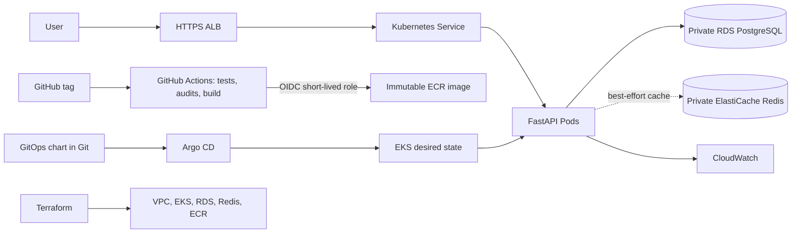

# Devopshere Cloud-Native Application Deployment Platform

A production-style learning project for shipping a task API to AWS EKS using Terraform, Docker, GitHub Actions, ECR, Helm, and Argo CD. PostgreSQL stores durable state; Redis is an optional cache. Tracked files contain no AWS account values or live credentials.

## Project status

- API, migrations, Compose stack, CI/security workflow, Helm chart, Argo CD application, Terraform foundation, CloudWatch alarms, load test, and operational labs are provided.
- AWS infrastructure is **not applied**. Account, region, state backend, CIDRs, domain/certificate, IAM trust, runtime secrets, and cost must be filled and reviewed.
- `image.tag` starts as `CHANGE_ME`; GitOps will not deploy a made-up image.
- Do not claim AWS deployment or performance metrics until you deploy and measure them yourself.

## Architecture and flows

Request: client -> HTTPS ALB -> Service -> ready API pod -> PostgreSQL. Redis is not authoritative; its failure only degrades cache performance. Delivery: tagged commit -> tests/audits/build -> OIDC role -> immutable ECR tag -> reviewed image tag in Git -> Argo CD reconciliation.

## Start locally

Prerequisites: Git, Python 3.12, Docker Desktop with Compose plugin. From `app/`:

~~~powershell
Copy-Item .env.example .env
# .env has fake local-only values and is ignored by Git.
docker compose up --build -d
docker compose ps
Invoke-RestMethod http://127.0.0.1:8000/health/live
Invoke-RestMethod http://127.0.0.1:8000/health/ready
Invoke-RestMethod http://127.0.0.1:8000/api/v1/tasks -Method Post -ContentType 'application/json' -Body '{"title":"first task"}'
docker compose logs --follow api
~~~

Stop while preserving local data: `docker compose down`. Remove the disposable DB volume too: `docker compose down -v`.

Unit tests without Docker:

~~~powershell
cd app
python -m venv .venv
.\.venv\Scripts\Activate.ps1
python -m pip install -r requirements-dev.txt
python -m pytest -q
~~~

## Repository map

- `app/`: FastAPI service, SQLAlchemy models, Alembic migrations, SQLite-backed unit tests, and local Compose stack.
- `deploy/helm/devopshere/`: Kubernetes chart; references an existing runtime Secret without embedding secret data.
- `deploy/argocd/`: Argo CD Application tracking `main`.
- `infra/terraform/`: VPC, private EKS nodes, private PostgreSQL/Redis, ECR, and CloudWatch alarms.
- `.github/workflows/`: PR checks and tag-only OIDC ECR publishing; no static AWS keys.
- `loadtest/`: k6 read-path test with p50/p95/p99 thresholds, no asserted result before running.
- `docs/`: requirements, architecture, deployment, security, operations, troubleshooting, runbooks, interview defense.

## Cloud setup

Read [DEPLOYMENT.md](docs/DEPLOYMENT.md) and [SECURITY.md](docs/SECURITY.md) before Terraform. It creates billable resources. Start with `fmt`, `init`, `validate`, and a reviewed `plan`; apply only when account, region, CIDRs, state backend, and expected charges have been reviewed. Current lab defaults are not HA production sizing.

## Git workflow

Use `main` for reviewed releases, `develop` for integration, and `feature/<scope>` for changes. Commit convention: `type(scope): concise change`, such as `feat(api): add task pagination tests`. Resolve CI findings before merge. Never commit `.env`, `terraform.tfvars`, state, plans, kubeconfigs, credentials, private keys, or production URLs with embedded secrets.

## Supported claims

Supported by repository artifacts: FastAPI/SQLAlchemy API; CRUD tests with SQLite and fake Redis; migration; Docker/Compose definitions; Terraform configuration; Helm/Argo CD manifests; GitHub Actions workflow definitions; failure-lab instructions. AWS deployment, end-to-end cloud behavior, recovery time, throughput, and latency remain unverified until measured in your account.
