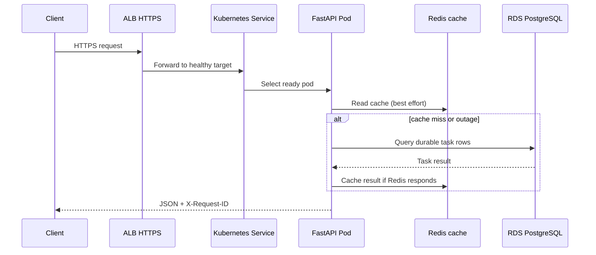
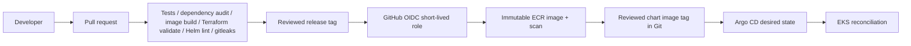

# Architecture

## Runtime

The external HTTPS ALB targets pod IPs through AWS Load Balancer Controller. EKS worker nodes are private; the Kubernetes API has private access and a public endpoint restricted to operator CIDRs. PostgreSQL is authoritative, Redis is best-effort cache. Readiness requires PostgreSQL and reports Redis degradation without failing the app. Liveness checks only the process.

## Request flow

Writes commit to PostgreSQL before cache invalidation. Cache errors are logged and do not make Redis a durability dependency. Connection pools are process-local; pod scaling must be sized against RDS connection capacity.

## Delivery flow

The publisher has no static AWS key and only runs for version tags after repository variables are configured. CD is GitOps: Argo CD reads chart configuration and reconciles cluster state. Updating the image in Git records release and rollback history.

## Network and trust boundaries

The VPC spans two or more AZs and separates public ingress, private node, and isolated database subnets. RDS/Redis accept connections only from the EKS node security group on their service ports; neither is publicly routable. EKS public API ingress is limited to explicit operator CIDRs and private endpoint access is enabled. ALB is public HTTPS; pods receive traffic only through target registration. For a private-only API, change the ALB scheme and DNS design before enabling ingress.

## Availability and scaling

Two API replicas, readiness/liveness/startup probes, PDB, HPA, and multi-AZ networking form a baseline. Lab defaults use one NAT, single-AZ RDS, and one Redis node to reduce expense; these are not a highly available production topology. HPA requires metrics API. RDS connection limits, cache failure behavior, migration duration, and NAT/AZ dependencies must be measured before production claims.

## Components

`infra/terraform` expresses network, compute, data, registry, and alarms; `app` is the service and local dev stack; `deploy/helm` packages Kubernetes desired state; `deploy/argocd` is the GitOps entry; `.github/workflows` validates and publishes tagged images; `docs/runbooks` contains controlled operational exercises.
